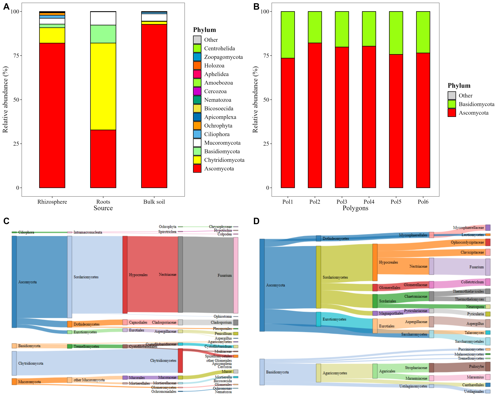

# 🍄🌱 MicroBioMeta_article

> Code and data to reproduce the analyses and figures of the article
> **"<!-- MicroBioMeta: An All-in-One R Package for microbiome data analysis and visualization -->"**, a showcase of the
> [**MicroBioMeta**](https://github.com/Steph0522/MicroBioMeta) R package 📦.

MicroBioMeta helps beginners analyze and visualize microbiome data with minimal coding.
This repository applies it to two real datasets, from loading the data to the
publication-ready figures.

---

## 🧬 Datasets

| | Dataset | Samples grouped by | Data in `data/` |
|---|---|---|---|
| 🍄 | **Fungal metabarcoding** (QIIME 2, SILVA) | Source (Bulk soil, Rhizosphere, Roots) × Treatment (TC, TD, TED) | `table_fungi.qza`, `taxonomy_fungi.qza`, `metadata_fungis.txt` |
| 🌍 | **Shotgun metagenomics** (Kraken2) | Polygon (Pol1–Pol6) + soil chemistry (pH, OM, N, P, K) | `table_kraken.txt`, `metadata_metagenomic.txt`, `coord_metagenomic.csv` |

## 🗂️ Workflow

Run the scripts in order. Each one calls `1.load_data.R` and saves its figures to `plots/`.

| Script | What it does | Main figure |
|---|---|---|
| 📥 `1.load_data.R` | Loads and preprocesses both datasets | — |
| 📊 `2.alpha.R` | Alpha diversity (Hill numbers, Venn diagram, alpha vs pH, sequencing depth) | `alpha_fig.png`, `alpha_depth_supp.png` |
| 🧭 `3.beta.R` | Beta diversity (ordinations, PERMANOVA, shared taxa, turnover, distance decay) | `beta_fig.png` |
| 🧱 `4.abundance.R` | Taxonomic composition (barplots, heatmaps, Sankey diagrams) | `abundance_fig.png`, `heats.png` |
| ⚖️ `5.differential_abundance.R` | Differential abundance (ALDEx2, ANCOM-BC2, random forest) | `differential_abundance.png` |
| 🌡️ `6.environmental.R` | Taxa–environment links (Spearman correlations, RDA) | `environmental.png` |

## ⚙️ Requirements

```r
# MicroBioMeta 📦
remotes::install_github("Steph0522/MicroBioMeta")

# Reading QIIME 2 artifacts (.qza)
remotes::install_github("jbisanz/qiime2R")

install.packages(c("tidyverse", "cowplot", "webshot2", "png"))
```

Open `MicroBioMeta_article.Rproj` in RStudio and run the scripts in order.
Steps that involve randomness use `set.seed(123)`.

> 💡 The Sankey diagrams are saved as HTML and converted to PNG with `webshot2`,
> which needs Chrome or Chromium installed.

## 🖼️ Preview



## 📖 Citation


If you use MicroBioMeta, please cite the package and the article.

## 👩‍🔬 Authors

- **Stephanie Hereira-Pacheco** ([ORCID](https://orcid.org/0000-0003-1433-8187)), maintainer ✉️ shereirap@gmail.com
- **Nina Montoya-Ciriaco** ([ORCID](https://orcid.org/0009-0000-3555-0692))
- **Karla Zarco-González** ([ORCID](https://orcid.org/0009-0003-3407-9036))
